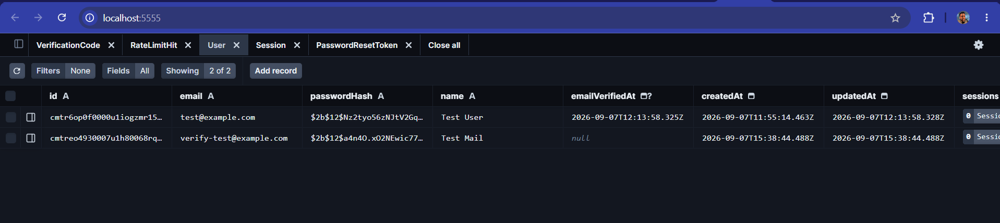
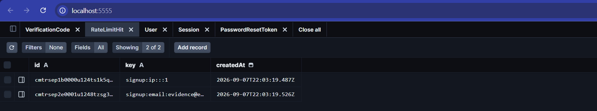
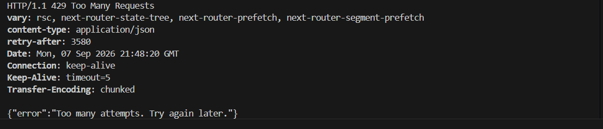
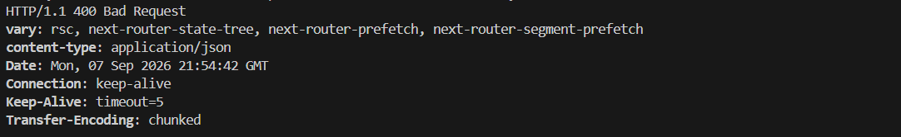
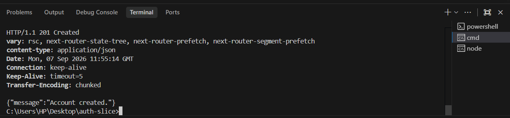
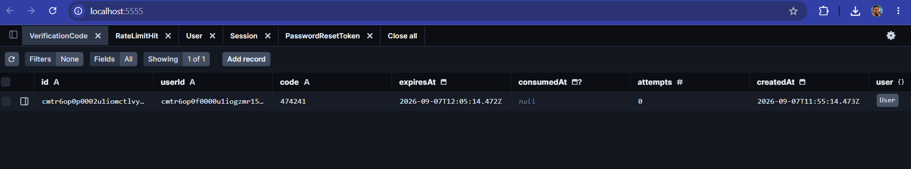
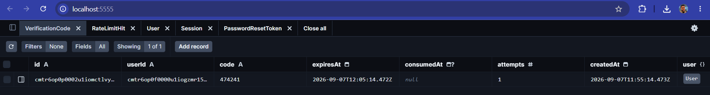
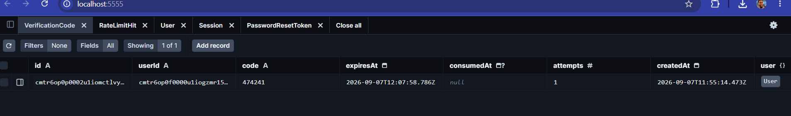
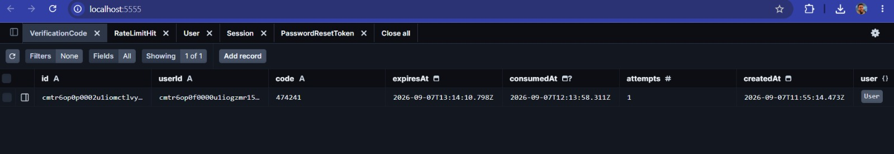

# Authentication Slice

## Section 1: What This Is

This repository contains a complete authentication system built without an authentication
library. A new user can create an account, receive a six-digit verification code by
email, verify their address, and reach a signed-in page. A returning user can sign in. A
user who has forgotten their password can request a reset link, set a new password, and
sign in with it. Sessions are stored in the database and are genuinely ended on sign out.
Passwords are hashed with bcrypt, every input is validated against a schema that the
browser and the server both import, and the four endpoints that cost money or invite
guessing are rate limited.

Deliberately not included: everything that is not authentication. There is no landing
page, no marketing copy, no profile editing, no settings, no social sign-in and no
two-factor. The page reached after signing in shows the user's name and a sign out
button, and nothing else — it exists to prove the session works, not to be a dashboard.
Emails are written to the server console rather than sent, because delivery is a provider
integration rather than an authentication concern; every email in the system goes through
one function, so replacing the console with a real provider is a single-file change.

---

## Section 2: How To Run It

**Prerequisites:** Node.js 20 or later, Docker Desktop, and Git.

1. **Clone and install**

   ```
   git clone https://github.com/ScrappyAT/auth-slice.git
   cd auth-slice
   npm install
   ```

2. **Create the environment file**

   ```
   copy .env.example .env      REM Windows
   cp .env.example .env        # macOS / Linux
   ```

   One variable is needed:

   | Variable | Where it comes from |
   |---|---|
   | `DATABASE_URL` | The Postgres connection string. The value committed in `.env.example` works as-is against the Docker container started in the next step. Change it only if you are pointing at your own Postgres instance. |

   Note the port is **5433**, not the Postgres default of 5432. See Section 6 for why.

3. **Start Postgres**

   ```
   docker compose up -d
   ```

   Confirm it is accepting connections before continuing — the container has a
   healthcheck, so wait for `healthy` rather than just `running`:

   ```
   docker compose ps
   ```

4. **Generate the Prisma client and apply migrations**

   ```
   npx prisma generate
   npx prisma migrate deploy
   ```

   `generate` must run before `migrate` on a fresh clone, because the generated client
   is not committed. Use `migrate deploy` rather than `migrate dev` — the migration
   history in `prisma/migrations/` is replayed rather than regenerated.

5. **Start the application**

   ```
   npm run dev
   ```

6. **Open it**

   `http://localhost:3000/signup`

   There is no page at `/` — this is a slice, and the brief's scope starts at the signup
   screen. Verification codes and reset links appear in the terminal running `npm run
   dev`, not in an inbox.

To inspect the database directly:

```
npx prisma studio
```

---

## Section 3: The Flow, Step By Step

### Creating an account

**The user** fills in name, email and password at `/signup`
(`app/(auth)/signup/page.tsx`) and submits.

**The frontend** validates against `signupSchema`, imported from
`lib/validation/schemas.ts` — the same object the server uses. If validation fails, no
request is made at all; errors render inline. On success it POSTs JSON to
`/api/auth/signup`.

**The server** (`app/api/auth/signup/route.ts`) checks the rate limit for both the
caller's IP and the submitted email, parses the body with the same `signupSchema`, hashes
the password with `hashPassword()` from `lib/auth/password.ts`, and attempts an insert.

Two things happen next depending on whether that email already exists, and both return
an identical `201`:

- **New email** — the row is inserted, `createVerificationCode()` in
  `lib/auth/codes.ts` generates a six-digit code with a ten-minute expiry, and
  `sendEmail()` in `lib/email.ts` delivers it.
- **Existing email** — Postgres rejects the insert with a unique constraint violation
  (`P2002`), which is caught. No code is created. A different email is sent to the
  address, telling the existing account holder that someone attempted to sign up.

The browser is redirected to `/verify?email=...`.

### Verifying the email

**The user** enters the six-digit code at `/verify` (`app/(auth)/verify/page.tsx`).

**The frontend** validates the shape against `verifyCodeSchema` and POSTs the code with
the email from the query string.

**The server** (`app/api/auth/verify/route.ts`) finds the newest unconsumed code for that
user and consumes it with a single conditional update — the `where` clause requires
`consumedAt: null` and an unexpired `expiresAt` together, and the returned row count is
the verdict. A wrong code increments `attempts`; past the cap, the code is refused
regardless of what is submitted. On success, `User.emailVerifiedAt` is set and
`createSession()` is called, so verification signs the user in directly.

Wrong code, expired code, already-consumed code and attempts-exhausted all return the
same message.

### Resending a code

**The user** clicks the resend control, which is disabled while a sixty-second countdown
runs.

**The server** (`app/api/auth/verify/resend/route.ts`) does not trust the countdown. It
calls `getResendCooldownRemaining()`, which derives the real cooldown from the newest
`VerificationCode.createdAt` for that user, and refuses to create a new code if the gap
is too short. The response is identical whether a code was sent, the email does not
exist, or the account is already verified.

### Signing in

**The user** submits email and password at `/signin` (`app/(auth)/signin/page.tsx`).

**The server** (`app/api/auth/signin/route.ts`) looks up the user and compares the
password against the stored hash — or, when no user exists, against a fixed dummy hash,
so bcrypt runs on every request regardless. Wrong email and wrong password return an
identical `401` in a comparable amount of time. An unverified account returns `403`.

On success, `createSession()` in `lib/auth/session.ts` generates 32 random bytes, stores
only their SHA-256 hash in the `Session` table, and sets the raw value in an httpOnly
cookie. The browser is redirected to `/dashboard`.

### Reaching the signed-in page

**The user** navigates to `/dashboard`.

**The server** (`app/dashboard/layout.tsx`) calls `requireSession()`, which reads the
cookie, hashes it, and looks for a matching unexpired row. No row means a redirect to
`/signin`. The page (`app/dashboard/page.tsx`) renders the user's name and a sign out
button whose action is a Server Action — a plain form POST with no client-side
JavaScript.

### Signing out

`destroySession()` deletes the `Session` row and clears the cookie. The row deletion is
the part that matters: any copy of that token elsewhere stops working immediately,
because there is nothing left for it to match.

### Resetting a password

**The user** submits their email at `/forgot-password`.

**The server** (`app/api/auth/forgot-password/route.ts`) generates 32 random bytes, stores
their SHA-256 hash in `PasswordResetToken` with a thirty-minute expiry, and emails a link
containing the raw token. When the email does not exist, it performs a no-op database
round trip instead, so the branch that does nothing does not return conspicuously faster.
Both branches return the same confirmation.

**The user** follows the link to `/reset-password?token=...` and sets a new password.

**The server** (`app/api/auth/reset-password/route.ts`) consumes the token with the same
conditional-update pattern used for verification codes, hashes the new password, updates
the user, and deletes every existing session for that user — so a password change also
signs out anyone who already had one.

---

## Section 4: The Data Model

Five tables. Schema at `prisma/schema.prisma`, migration at
`prisma/migrations/20260904145359_init/migration.sql`.

### `User`

Holds one account.

| Column | Decision |
|---|---|
| `id` | `cuid()` rather than an auto-incrementing integer. Sequential integers reveal how many accounts exist and make neighbouring records guessable. |
| `email` | `@unique`. Enforced by Postgres, not by application code — see Section 5. Normalised to lowercase and trimmed inside `signupSchema` before it ever reaches the constraint, because otherwise `Foo@x.com` and `foo@x.com` would be two accounts and the constraint would have prevented nothing. |
| `passwordHash` | Not nullable. There is no path to an account without a password, so a null here would represent a state that cannot legitimately exist. |
| `emailVerifiedAt` | Nullable `DateTime`, not a boolean. Null means unverified; a value means verified *and* records when. Same storage cost, strictly more information. |

### `Session`

One live session. Deleted on sign out and on password reset.

| Column | Decision |
|---|---|
| `tokenHash` | `@unique`. Stores SHA-256 of the token, never the token. The cookie holds the only copy of the raw value. |
| `expiresAt` | Checked inside the lookup query rather than after fetching, so an expired session cannot be read and then rejected in two steps. |
| `userId` | Foreign key with `onDelete: Cascade`. Deleting a user cannot leave orphaned sessions behind. |

### `VerificationCode`

One six-digit code issued to one user.

| Column | Decision |
|---|---|
| `code` | `Char(6)`, stored in plaintext. Hashing a six-digit code achieves nothing — a million candidates can be enumerated instantly — so the protection is expiry, the attempts cap and rate limiting instead. Storing it plainly and saying so is more honest than hashing it and implying otherwise. |
| `expiresAt` | Ten minutes. Enforced in the query, not in the interface. |
| `consumedAt` | Nullable timestamp rather than a `used` boolean. Consumed with a conditional update so the check and the write are one operation. |
| `attempts` | The thing that makes a six-digit code viable. Bounds total guesses against one code regardless of how slowly they arrive. |
| `@@index([userId, createdAt])` | The resend cooldown is derived from the newest code for a user, so this is the exact shape of that lookup. |

### `PasswordResetToken`

One reset link.

| Column | Decision |
|---|---|
| `tokenHash` | `@unique`. SHA-256 of 32 random bytes. A fast hash is correct here — the token is high-entropy, so there is nothing to slow down. |
| `expiresAt` | Thirty minutes, far shorter than a session, because the token lives in an inbox rather than in a browser the user has already authenticated. |
| `consumedAt` | Same single-use pattern as verification codes. |

### `RateLimitHit`

One recorded request against one key.

| Column | Decision |
|---|---|
| `key` | A composite string of endpoint, dimension and value — `signup:ip:::1` and `signup:email:user@example.com` are two real rows from a single signup request. One table serves every limit rather than a column per endpoint, and the two-dimensional keying is visible in the data rather than only in the code. |
| `@@index([key, createdAt])` | Every read is "count rows for this key since this time". Without this index it is a table scan on the hottest table in the schema. |

### Which constraints make an invalid state impossible

- **`User.email @unique`** — two accounts with the same address cannot exist, even if two
  requests arrive in the same millisecond and both pass any application-level check.
- **`Session.tokenHash @unique`** and **`PasswordResetToken.tokenHash @unique`** — one
  token cannot map to two rows, so a lookup can never be ambiguous.
- **`onDelete: Cascade` on every foreign key** — no session, code or token can reference
  a user who no longer exists.
- **`passwordHash` not nullable** — an account without a credential is unrepresentable.

---

## Section 5: The Concepts

### Password Hashing

**What it is.**
Password hashing is the process of taking a password and running it through a one-way hashing function that produces a fixed-length value. The original password cannot be recovered from the hash. In my application, I never store the user's actual password. When a user signs in, the password they enter is checked against the stored hash to confirm that it is correct.

**Why it is needed.**
I need password hashing because storing passwords as plain text would be a major security risk. If someone gained access to the database, they would immediately have access to every user's password. This becomes even worse because people often reuse the same password across different services.

With hashing, an attacker who gets access to the database does not immediately get the original passwords. They would have to try possible passwords and compare their hashes against the stolen hashes. I used bcrypt because it is deliberately slow, which makes this process much more expensive for an attacker.

With bcrypt at cost 12, a password check takes about 602 ms on my machine. Based on my testing, trying ten million common passwords against one hash would take roughly 70 days of continuous CPU time. With a fast general-purpose hash such as SHA-256, the same type of guessing would be dramatically faster, which is not what I want for passwords.

**How I implemented it.**
I used bcrypt with a cost factor of 12. I kept all of the password-related logic in `lib/auth/password.ts`, which exposes two functions: `hashPassword()` and `verifyPassword()`.

That file is the only place in the application that directly imports bcrypt. Passwords are hashed when a user signs up or resets their password, while `verifyPassword()` is used during sign-in.

I also made the cost factor a named constant instead of putting the number directly into the function call. That makes it easier to change later if I need to adjust the work factor.

I tested different bcrypt costs on my machine using five runs for each:

| Cost |   Average |
| ---- | --------: |
| 4    |    2.7 ms |
| 12   |  602.7 ms |
| 14   | 2460.2 ms |

The results showed the expected increase in work as the cost factor increases. Cost 12 gave me a reasonable balance: it makes each password attempt expensive enough to slow down brute-force attacks without making a normal login take several seconds.

**Evidence.** The `User` table, showing two accounts with distinct stored hashes and no
plaintext password column anywhere in the schema. The `$2b$` prefix identifies bcrypt and
the `$12$` that follows it is the cost factor — so the algorithm and the work factor are
both readable from the data itself, not only from my code.




**What I chose against, and why.**
I did not use SHA-256 for passwords because it is designed to be fast. That is useful for many types of data, but it is not ideal for passwords because attackers also benefit from that speed when trying large numbers of guesses.

Argon2 would also have been a valid option and is generally considered a stronger modern choice for password hashing. I chose bcrypt because it is well supported in my current stack and, more importantly, I understood how it behaves and how to configure it. I preferred using something I could confidently implement and reason about rather than choosing a newer option without being as familiar with it.

I also considered `bcryptjs`. It would have avoided the native-module dependency, which can make fresh installations easier, but I stayed with bcrypt for this implementation because of the performance characteristics I measured.

To be honest about that trade-off: the native dependency is a real cost, and I have recorded it in Section 7 as the thing in this repository most likely to fail on someone else's machine. It installed cleanly here because a prebuilt binary was available for my platform. If I were handing this to a team on mixed environments rather than submitting it as a slice, I would probably take the slower pure-JavaScript version and remove the build step entirely.

---

### Rate Limiting

**What it is.**
Rate limiting is a way of controlling how many times someone can call an endpoint within a certain period. Once the limit is reached, additional requests are rejected until the window has passed.

**Why it is needed.**
Rate limiting is particularly important for my authentication endpoints because some of the operations are intentionally expensive.

For example, a sign-in attempt takes roughly 600 ms because bcrypt has to run even when the password is incorrect. Without rate limiting, an attacker could send a large number of requests and use the authentication endpoint to consume a significant amount of server resources.

The resend-verification endpoint has a different problem. Every successful request can result in an email being sent. If I allowed unlimited requests, someone could repeatedly trigger emails and either increase my email costs or spam another person's inbox.

There is also a security concern with the six-digit verification code. There are one million possible combinations, so I do not want an attacker to be able to submit guesses as quickly as the network allows during the ten-minute validity period.

**How I implemented it.**
I implemented a sliding-window rate limiter using the `RateLimitHit` database table. The main logic is in `lib/rate-limit.ts`, which exposes a single function:

`checkRateLimit(key, limit, windowSeconds)`

The function checks how many requests have been made for a particular key during the current window, removes expired records, and records a new request when it is allowed.

If the limit has already been reached, the request is rejected with HTTP `429`, and I return a `Retry-After` header so the client knows when it can try again.

I use different limits for different endpoints because they do not all have the same cost or risk:

| Endpoint        | Limit |     Window | Reason                                                                        |
| --------------- | ----: | ---------: | ----------------------------------------------------------------------------- |
| Sign in         |    10 | 15 minutes | Limits expensive bcrypt attempts while still allowing genuine typing mistakes |
| Sign up         |     5 |     1 hour | Reduces scripted account creation                                             |
| Forgot password |     5 |     1 hour | Limits repeated email-related requests                                        |
| Verify/resend   |     3 |     1 hour | Controls an endpoint that can trigger email delivery                          |

For the protected endpoints, I check both the caller's IP address and the submitted email address. I check the IP first so that if the IP has already exceeded its limit, I can reject the request without doing the second lookup.

**Evidence.** A single signup request writes two rows to `RateLimitHit`, one per key
dimension, nine milliseconds apart:



And the limit refusing a request once the window is full. The message shown to the user
is read from the server's `Retry-After` header rather than guessed at by the page — note
also that this request used an email address that had never been seen before, so the block
came from the IP dimension:




**What I chose against, and why.**
One option was to keep the rate-limit information in an in-memory `Map`. That would be faster and simpler, but it would reset whenever the application restarted or was redeployed. It would also not work properly across multiple server instances.

Redis would be a better solution for a larger production system, especially when the application is running across multiple instances. For this implementation, I chose the database because I did not have Redis available and wanted the rate limiting to remain persistent across restarts and deployments.

I also made a deliberate decision not to record rejected requests as new rate-limit hits.

The reason is that if every rejected request extended the window, an attacker could keep sending requests for a particular email address and effectively keep the legitimate user locked out indefinitely. By only recording allowed requests, the rate limit eventually resets even if someone continues attacking it.

**Why keying on IP alone is insufficient.**
I did not want to rely only on IP addresses because an IP address does not necessarily represent one person.

An attacker could rotate through proxies, different networks, or mobile connections and potentially get around an IP-only limit. At the same time, multiple legitimate users can share the same public IP address.

That is why I use both the IP address and the submitted email address.

I tested this by making four requests against the same email address from different IP addresses. Even though the IP addresses had not been seen before, the request was still blocked because the account-level limit followed the email address.

The reverse is also important. If I only limited by email, one attacker could make a small number of attempts against many different accounts and stay below each individual account's limit.

Using both dimensions gives me protection against both situations.

---

### Client-Side Versus Server-Side Validation

**What it is.**
Client-side and server-side validation perform similar checks, but they have different purposes.

Client-side validation is mainly there to give the user immediate feedback. For example, if they enter a password that is too short, the browser can tell them immediately without making a request to the server.

Server-side validation is the actual security control. The server cannot trust anything that comes from the browser because the user controls the client.

**Why it is needed.**
The important thing I had to remember is that client-side validation can be bypassed.

Someone can use `curl`, Postman, a custom script, browser developer tools, or a modified client and completely skip the validation that I put in the frontend.

For that reason, I made sure that the server validates every request independently.

I tested this by sending an invalid request directly to `/api/auth/signup`:

`{"email":"not-an-email","password":"abc","name":""}`

The server returned a `400` response with field-level validation errors in about 11 ms. These are values that the frontend form would normally reject before sending the request, but the server still rejected them when I bypassed the frontend completely.

**Evidence.** The request and the response, made with `curl` so the browser and its
validation are not involved at all:



For comparison, the same endpoint accepting a valid request:




**How I implemented it.**
I created five Zod schemas in `lib/validation/schemas.ts`:

* `signupSchema`
* `signinSchema`
* `resetRequestSchema`
* `resetPasswordSchema`
* `verifyCodeSchema`

I also use the inferred TypeScript types from these schemas.

The API routes use the schemas to validate incoming requests, while the frontend forms use the same schemas to provide immediate feedback to the user.

This was intentional. Instead of writing the same validation rules separately on the frontend and backend, I defined them once and reused them in both places. This reduces the chance of the two sides having different rules.

I also normalise email addresses inside the schema by trimming whitespace and converting the address to lowercase before it reaches the database.

That means something like `Foo@x.com` and `foo@x.com` are treated as the same email address. This is important because the database's unique constraint works on the stored value, so normalising the email before saving it prevents duplicate accounts caused by different casing.

Two validation rules are particularly important.

The password has a minimum length of 8 and a maximum of 72 characters. The maximum exists because bcrypt only processes up to 72 bytes of the password. Without the limit, a user could enter a password longer than 72 characters without realising that the extra part was not contributing to the bcrypt hash.

For sign-in, I use `min(1)` instead of enforcing the current minimum password length. This is deliberate because a user might have created an account under an older password policy. I do not want the sign-in form to prevent them from logging in simply because their existing password does not meet a newer signup requirement.

I also tested the client-side validation using a headless browser. Submitting an empty signup form produced three inline validation errors and made zero network requests. This confirmed that the frontend was actually using the shared validation schema rather than simply relying on the backend.

**What I chose against, and why.**
I decided not to require a combination of uppercase letters, numbers, and special characters.

My reasoning was that password length is more useful than forcing users into a particular character pattern. Composition rules can also encourage predictable passwords such as `Password1!`, because users often make simple substitutions just to satisfy the requirements.

I also chose not to maintain separate validation rules for the client and server. Having two copies might seem straightforward at first, but over time they can become different without anyone noticing. Sharing the same schemas avoids that problem.

**Which of my rules cannot be enforced on the client, and why.**
Anything that depends on information stored on the server cannot be reliably enforced by the client.

For example:

* **Email uniqueness:** The browser can check whether the email looks valid, but it cannot know whether that email already exists in the `User` table.
* **Whether a password is correct:** The browser does not have access to the stored password hash and should never have it.
* **Whether an email has been verified:** This depends on the server-side `emailVerifiedAt` value.
* **Whether a verification code or reset token is valid:** The client can check that a code contains six digits, but it cannot know whether those are the correct digits, whether the code has expired, whether it has already been used, or whether the user has exceeded the attempt limit.
* **Rate limits:** These depend on server-side `RateLimitHit` records and therefore cannot be trusted if controlled by the client.

The way I think about it is that the client can validate the **shape** of the data, but the server has to validate the **truth** of the data against the actual application state.

---

### Session Management

**What it is.**
HTTP requests are stateless, so by default the server does not automatically remember who made the previous request.

A session gives the application a way to remember that a user has successfully authenticated.

After a successful sign-in, my server generates a random session token, stores information about that session in the database, and sends the token to the browser in a cookie.

The browser then sends the cookie with subsequent requests. The server uses the token to find the corresponding session and determine which user is making the request.

The token itself does not contain the user's ID, email, role, or other information. It is just a random value that points to the session stored on the server.

**Why it is needed.**
Without a session, the application would need another way to authenticate every request.

One approach would be to send the user's credentials repeatedly, but that would expose the credentials unnecessarily and would require the browser to keep them somewhere.

A session lets the user authenticate once and then use a temporary session token for subsequent requests.

**How I implemented it.**
The session logic is in `lib/auth/session.ts`, which contains:

* `createSession()`
* `getSession()`
* `destroySession()`

When I create a session, I generate 32 random bytes using `crypto.randomBytes`.

I do not store the raw session token in the database. Instead, I hash it using SHA-256 and store the resulting value in `Session.tokenHash`.

The raw token is sent to the browser in the cookie.

When the browser makes another request, `getSession()` hashes the incoming cookie value and looks for the corresponding hash in the database. I also check the `expiresAt` value as part of the database query so an expired session cannot be treated as valid.

When the user signs out, `destroySession()` deletes the session record and clears the cookie.

The session lifetime is seven days.

I also configured the cookie with several security-related flags:

| Flag                          | Purpose                                                                                 |
| ----------------------------- | --------------------------------------------------------------------------------------- |
| `httpOnly`                    | Prevents JavaScript running in the browser from directly reading the session cookie     |
| `secure` in production        | Ensures the cookie is only sent over HTTPS                                              |
| `sameSite: lax`               | Helps reduce CSRF risk while still allowing normal navigation such as links from emails |
| `path: /`                     | Makes the cookie available across the application                                       |
| `maxAge` matching `expiresAt` | Keeps the browser's cookie lifetime aligned with the database session                   |

The cookie only contains the random opaque token. It does not contain the user ID, email, role, or an expiry value that the user could modify.

**Why the token is hashed in the database even though it is already random.**
The randomness and hashing solve two different problems.

The randomness makes the session token difficult to guess. Since I generate 32 random bytes using a cryptographically secure random number generator, an attacker should not be able to predict a valid token.

Hashing the token before storing it protects against a different problem: database exposure.

If someone obtained read access to the `Session` table and I had stored the raw tokens, those tokens could potentially be used immediately to impersonate users.

By storing only the SHA-256 hash, the database does not contain the actual value that the browser uses.

This is similar to the reasoning behind not storing plaintext passwords, although session tokens are already high-entropy and therefore do not need the deliberately slow hashing that passwords require.

**What I chose against, and why.**
I chose a database-backed session instead of a stateless JWT.

JWTs have an advantage because they can be verified without looking up a session in the database. However, that also creates a problem for this particular implementation.

If I need to immediately invalidate a session when the user signs out, a database-backed session makes that straightforward. `destroySession()` deletes the session row, so the next request using that token will fail because there is no longer a matching session.

With a purely stateless JWT, deleting the browser cookie does not invalidate a copy of the token that someone might have obtained earlier. That token could remain valid until it expires.

Since proper session invalidation was an important requirement, I chose the database-backed approach.

I also used SHA-256 rather than bcrypt for the session token hash. The reason is that the session token is already generated randomly and has high entropy, so using a deliberately slow password hash would add a significant cost to every authenticated request without providing a meaningful benefit.

---

### Token and Code Expiry

**What it is.**
Verification codes and password reset tokens should not remain valid forever.

In my implementation, each code or token has an expiry time stored in the database. The server checks that expiry whenever the code or token is used.

**Why it is needed.**
A credential that never expires becomes a long-term security risk.

For example, a six-digit verification code has one million possible combinations. If the code never expired, an attacker would have unlimited time to try different combinations.

Expiry also prevents old verification codes from remaining valid indefinitely.

For my verification flow, a code is valid for ten minutes and the user is also limited in the number of attempts they can make. This gives an attacker a small window and a limited number of guesses.

Password reset tokens are even more sensitive because they can provide a path to changing someone's password. I therefore give them a relatively short lifetime as well.

**Why expiry must live in the database rather than the interface.**
A countdown displayed on the frontend is only for the user's benefit. It does not actually enforce anything.

For example, the frontend might display "9 minutes remaining," but someone could open developer tools and call the API directly without interacting with the countdown at all.

The server therefore has to make the actual expiry decision.

I tested this by taking a valid verification code from the database, manually changing its `expiresAt` value to a time in the past, and then submitting the correct code through the actual form.

The request was rejected even though the code itself was correct. This confirmed that expiry was being enforced by the server rather than simply displayed by the frontend.

**Evidence.** The verification code as issued, with `expiresAt` ten minutes after
`createdAt`, `consumedAt` still null and `attempts` at zero:



The same row after a wrong submission, showing `attempts` incremented — the counter is
persisted in the database, not held in memory:



The same row after its `expiresAt` was pushed into the past:



And the same row after the correct code was accepted, with `consumedAt` populated — which
is what makes a second submission of the same code fail:




**How I implemented it.**
`VerificationCode` has an `expiresAt` value set to ten minutes after creation. The value is defined as a constant in `lib/auth/codes.ts`.

`PasswordResetToken` has a 30-minute expiry, with the constant defined in `lib/auth/tokens.ts`.

I check the expiry directly in the database query that consumes the record. This means I am not simply fetching a token, checking it in application code, and then using it later. The expiry condition is part of the database operation itself.

For the resend cooldown, I did not create a separate `lastSentAt` field.

Instead, `getResendCooldownRemaining()` looks at the most recent `VerificationCode.createdAt` value and compares it with the 60-second cooldown.

This means I have one source of truth: the verification code records themselves.

The verification page still shows a 60-second countdown, but that countdown is only a convenience for the user. The server remains responsible for enforcing the actual cooldown.

I also deliberately return the same general response for an incorrect code, expired code, already-consumed code, and exhausted attempts.

The reason is to avoid giving an attacker unnecessary information about the state of the verification code. For example, telling someone that a code has expired confirms that the account had a valid code at some point.

**Why the reset token expires much sooner than the session.**
The two tokens have different purposes and different security considerations.

A session is created after the user has already authenticated and is intended to keep them signed in for a period of time. I chose seven days because constantly requiring users to sign in again would make the application inconvenient.

A password reset token is different. It is normally delivered through email and is only needed for the immediate password-reset process.

Because the reset token is more temporary and can potentially be exposed through an email account, I chose a much shorter lifetime of 30 minutes.

That gives the user enough time to open the email and complete the reset without leaving the reset link valid for days.

**What I chose against, and why.**
I chose `consumedAt` instead of simply using a `used` boolean because the timestamp gives me more information about when the token was consumed.

I also rejected client-side-only expiry because the client cannot be trusted to enforce security rules.

Finally, I decided not to add a separate `lastSentAt` field for the resend cooldown. Deriving the cooldown from the latest verification code means I do not have two separate pieces of state that could potentially disagree.

---

### Idempotency

**What it is.**
Idempotency means that repeating the same operation does not create additional unintended effects.

For example, if a user accidentally submits a signup request twice, I do not want two accounts to be created for the same email address.

**Why it is needed.**
Duplicate requests do not necessarily mean someone is attacking the application.

A user might double-click a button, a network connection might retry a request, or a browser might resend a request after the user refreshes the page.

Without protection, two signup requests could potentially create duplicate accounts or cause the second request to return an error even though the first request had already succeeded.

That would leave the user thinking something went wrong even though their account was actually created.

**How I implemented it.**
In `app/api/auth/signup/route.ts`, I attempt to create the user directly and rely on the database's unique constraint for the email address.

If Prisma returns a `P2002` unique constraint error, I catch it and return the same `201` response used for a successful signup.

Importantly, I do not overwrite the existing user's password or name, and I do not create another verification code in that branch.

I tested this using two genuinely concurrent requests with the same email address but different names and passwords.

Both requests returned `201`, but the database contained exactly one user record. The data from the first request remained in the database, while the second request's name was not stored.

**Which prevents the second row: my application code or the unique constraint?**
The database constraint is what actually prevents the second row.

There is intentionally no application-level "check if the email exists" before the insert.

A check-then-insert approach can have a race condition. Two requests could both check the database at almost the same time, both see that the email does not exist, and both attempt to insert.

The unique constraint in Postgres handles this safely. The first insert succeeds, and the second insert is rejected by the unique index on `User.email`.

My application code then catches that database error and converts it into the appropriate response.

One useful side effect of the implementation is that bcrypt runs before the insert for both cases. This means a new email and an existing email take roughly the same amount of time to process, which makes it harder to distinguish the two cases based purely on response timing.

**What I chose against, and why.**
I considered creating a separate idempotency-key table where every request would include a unique key that the server could track.

That is a useful general solution, especially when there is no natural unique identifier for the operation.

In this particular signup flow, however, the email address is already a natural key and the database already enforces its uniqueness. Adding another table would have increased the complexity without giving me an additional guarantee that I needed.

I also chose not to return a specific "email already exists" message. While that would be more user-friendly, it could also make the endpoint useful for discovering which email addresses have accounts.

---

### Database Constraints as a Last Line of Defence

**What it is.**
Database constraints are rules that the database itself enforces whenever data is written.

Examples include unique constraints, foreign keys, not-null constraints, and check constraints.

The main benefit is that the rule remains enforced even if application code has a bug or another part of the application forgets to perform a particular check.

**Why it is needed.**
Application code can change.

Someone could add a new route in the future and forget to perform a check that another route already performs. A database constraint gives me a final layer of protection regardless of which route is being used.

The clearest example in my implementation is the user email.

My signup code does not first check whether the email already exists. Instead, the database has a unique constraint on `User.email`.

This is particularly important under concurrency because a normal check-then-insert implementation can have a race condition.

**How I implemented it.**
I added `@unique` to:

* `User.email`
* `Session.tokenHash`
* `PasswordResetToken.tokenHash`

I also use `onDelete: Cascade` on the relevant foreign keys and make `User.passwordHash` non-nullable.

The actual database constraints are present in:

`prisma/migrations/20260904145359_init/migration.sql`

This is important because the protection exists in the actual database schema, not just in the Prisma model.

The constraints provide several guarantees:

* **`User.email @unique`** prevents two user records from having the same email address.
* **`tokenHash @unique`** prevents the same token hash from being associated with multiple rows.
* **`onDelete: Cascade`** ensures related sessions, codes, and tokens are removed when their associated user is deleted.
* **`passwordHash` being non-nullable** prevents an incomplete user record from being created without a password hash.

There is one important detail with the email constraint. The unique constraint can only compare the values it receives.

That is why I normalise the email address in `signupSchema` before it reaches the database. Without that step, `Foo@x.com` and `foo@x.com` would technically be different strings and could potentially be stored as two separate records.

**What I chose against, and why.**
I chose not to rely entirely on application-level checks.

An application-level check such as "look up the email and then insert if it does not exist" seems correct during a normal manual test, but it can fail when two requests arrive at almost the same time.

The database is in a better position to enforce the uniqueness rule because it controls the actual write operation.

I also chose not to make `emailVerifiedAt` non-nullable with a default value.

Although that would technically ensure every account was marked as verified, it would not represent the actual state of my authentication flow. A user needs to exist in the database before they have confirmed their email, so having `emailVerifiedAt` nullable is intentional.

---

### Protected Routes

**What it is.**
A protected route is a page or endpoint that checks whether the current user has a valid session before allowing access.

For my dashboard, the check happens on the server before the dashboard content is rendered.

**Why it is needed.**
Simply hiding a dashboard link from the navigation does not protect the dashboard.

Someone can still manually enter `/dashboard` in the browser or access the route directly.

The route itself therefore needs to verify that the user has a valid session.

**How I implemented it.**
I created `requireSession()` in `lib/auth/session.ts` and call it from `app/dashboard/layout.tsx`.

`requireSession()` uses `getSession()`, which reads the session cookie, hashes the token, and checks the database for a matching session whose `expiresAt` has not passed.

If there is no valid session, the application redirects the user to:

`/signin`

I put this check in the dashboard layout instead of repeating it on every individual dashboard page.

That means every route underneath `/dashboard` automatically inherits the protection.

I tested the route in three different situations:

1. **No session cookie:** The user is redirected to `/signin`.
2. **Valid session:** The dashboard renders normally.
3. **Previously valid session after sign-out:** The request is rejected and redirected to `/signin`.

The third case was the most important test for me.

After signing out, I replayed the exact raw session token that had previously worked. It was rejected because the session row had been deleted from the database.

This means the application is not simply trusting whether the browser still has a cookie. The database session has to exist and still be valid.

It also means that signing out in one browser tab invalidates that session elsewhere because the server-side session itself has been removed.

**What I chose against, and why.**
I considered using Next.js middleware as the main protection mechanism because middleware is a common place to perform route checks.

The problem in this application is that my middleware runs in an environment where Prisma cannot directly query the `Session` table with the setup I am using.

Middleware could check whether a cookie exists, but that would not tell me whether the session represented by that cookie is actually valid.

For example, a cookie could still exist in the browser even after I have deleted the corresponding session from the database during sign-out.

A middleware-only solution would therefore be able to tell me that "a session cookie exists," but not that "this session is valid."

For that reason, I placed the real session check in the dashboard layout where Prisma can perform the database lookup.

Middleware could still be used as an additional lightweight check in the future—for example, to immediately redirect requests that have no session cookie—but it would not replace the database-backed session check.

I also chose not to check the session separately inside every dashboard page.

Doing that would work, but it would mean every new page added under `/dashboard` would depend on the developer remembering to add the same security check.

Putting the check in the shared layout gives me one central place where the protection is applied automatically to all dashboard routes.

---

## Section 6: What Went Wrong

### Port 5432 was already allocated

**The symptom.** `docker compose up -d` failed with `Bind for 0.0.0.0:5432 failed: port is
already allocated`. The container was created but never started.

**The investigation.** `netstat -ano | findstr :5432` returned PID 14752. `tasklist /fi
"pid eq 14752"` identified it as `com.docker.backend.exe` — which ruled out the thing I
first assumed, a native Postgres service installed on Windows, and pointed instead at
another container. `docker ps -a` showed `draganddrop-postgres-1`, from an unrelated
project four weeks old, publishing 5432 and auto-started by Docker Desktop.

**The cause.** A container from a different project held the host port. Nothing to do with
this project's configuration.

**The fix.** Published this project's Postgres on host port 5433 rather than stopping the
other container, so both projects run at once. Updated `DATABASE_URL` and `.env.example`
to match, and noted the non-default port in Section 2 — a reviewer copying `.env.example`
would otherwise have no way to know.

### The Prisma CLI and client resolved to mismatched major versions

**The symptom.** After `npm install prisma`, `npm ls` reported `prisma@7.10.0 invalid:
"^8.0.0-rc.12"`.

**The investigation.** npm's `latest` tag for the Prisma CLI pointed at `8.0.0-rc.12`, a
release candidate, while `@prisma/client` resolved to `7.10.0` stable. An unpinned install
was therefore not reproducible — a reviewer cloning a week later could resolve something
different. Pinning both to 7.10.0 surfaced a second, larger problem: Prisma 7 removed
support for the plain `datasource { url = env("DATABASE_URL") }` block this schema uses,
and now requires a `prisma.config.ts` plus a driver-adapter package before `migrate dev`
will run at all.

**The cause.** Two independent issues. `latest` on the CLI was a prerelease, and the 7.x
line is a breaking change against the datasource style the schema was written in.

**The fix.** Pinned both packages to 6.19.3, the last stable 6.x. Works with the schema
unchanged, no config file, no adapter dependency. Chose this over adopting the 7.x adapter
setup because none of it is being assessed and it adds setup a reviewer would have to
reproduce. Section 7 records what that choice costs.

### `.env.example` was silently gitignored

**The symptom.** A commit reported "1 file changed" when I expected two. `git status`
showed nothing wrong — working tree clean.

**The investigation.** `git status` does not list ignored files at all, so the absence was
invisible there. `git check-ignore -v .env.example` returned `.gitignore:34:.env*`, the
line intended to protect `.env` — the wildcard was catching `.env.example` too.

**The cause.** `.env*` matches `.env.example` as well as `.env`.

**The fix.** Added `!.env.example` immediately below it. Verified with `git ls-files |
findstr env`, which now returns `.env.example` and nothing else — `.env` untracked,
`.env.example` tracked, both confirmed rather than assumed. Without this, `.env.example`
would have been absent from the repository and a reviewer would have had no way to know
which variables to set or what `DATABASE_URL` should look like.

---

## Section 7: What This Slice Does Not Handle

**Rate limiting is expensive.** Each protected request costs six extra database queries in
the normal case — a prune, a count and an insert, on each of two keys. Every one hits the
`[key, createdAt]` index, so they are cheap individually, but the count is real. Redis
would collapse this to roughly zero marginal cost. This is the direct consequence of
choosing a database-backed limiter over an in-memory one, and it is the right trade at this
scale and the wrong one at any real scale.

**The rate limiter is marginally over-conservative under compound pressure.** Because the
IP key is checked before the email key, a request rejected by the email check has already
spent a hit on its IP key. Never less safe, just not perfectly efficient. Fixing it needs a
peek/commit split that the single `checkRateLimit()` primitive does not have room for.

**Emails are logged to the console, not sent.** Every email goes through one `sendEmail()`
function, so swapping in a provider is a single-file change — but as it stands, nobody
receives anything.

**Three constants are duplicated rather than shared.** The resend cooldown of sixty seconds
exists in both `lib/auth/codes.ts` and the verify page, because importing the server module
into a client component would pull Prisma into the browser bundle. They can now drift
silently. See Section 8.

**`bcrypt` is a native module.** It installed cleanly here because a prebuilt binary was
available for this platform, but a reviewer on a different setup could hit a compile
failure. `bcryptjs` is pure JavaScript and would remove that risk at the cost of being
slower.

**Pinning to Prisma 6.19.3 carries a known advisory.** `npm audit` reports high-severity
issues in `@prisma/config`, a dependency of the Prisma CLI rather than of the runtime
client, so it does not sit in the request path. A production deployment would want the
upgrade, which means adopting the 7.x driver-adapter setup deferred in Section 6.

**The IP dimension of the rate limiter would not survive a proxy.** It reads the
connection's remote address, which is `::1` in local development. Behind a load balancer,
a CDN or any reverse proxy, every request arrives from the proxy's address instead — so
the IP key would stop distinguishing callers entirely and collapse into one shared bucket
for the whole internet. A production deployment would need to read `X-Forwarded-For`, and
to trust that header only when the request comes from a known proxy, because otherwise a
caller can simply set it themselves and defeat the limit from the other direction.

**Retry times are shown in seconds.** A rate-limited user is told to try again in "1168
seconds" rather than nineteen minutes. Correct and unhelpful.

**Timing parity is narrowed, not eliminated.** The endpoints that must not reveal whether
an email exists do comparable work on both branches — bcrypt runs unconditionally at signin
and signup, and a no-op query stands in for the write at forgot-password. Measured, the
branches fall within the same band and the gap is smaller than the noise. That is not the
same as identical, and I have not claimed otherwise.

**Left out because it was outside the brief:** two-factor, social sign-in, profile
editing, settings, session listing and revocation, remember-me, and any page at `/`.

**Left out because I ran out of time:** the shared constants module, formatted retry times,
and a peek/commit rate-limit primitive.

---

## Section 8: If I Built This Again

I would create a single dependency-free constants module before writing any feature code,
and require every timing value to come from it. Three values are currently duplicated —
most visibly the sixty-second resend cooldown, which exists separately in
`lib/auth/codes.ts` and in the verify page because importing the server module into a
client component would drag Prisma into the browser bundle. Each duplication was a
reasonable local decision and together they are a pattern: the constraint is real, and I
worked around it three times instead of solving it once. Because these numbers are the
things a user sees and the server enforces, a drift between the two versions would not
break anything loudly. It would produce a countdown that lies, which is precisely the class
of bug this assessment is about — an interface that reports a rule the server is not
actually applying.
