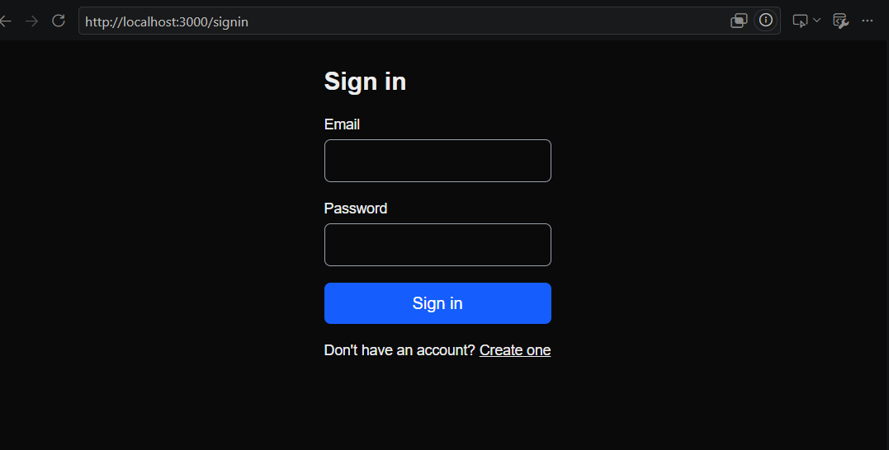

# Authentication Slice

A security-focused authentication system built from first principles with Next.js, TypeScript, Prisma and PostgreSQL — without relying on an authentication library.

The project explores what happens behind authentication libraries: account creation, email verification, password hashing, sessions, password resets, validation and protections against common authentication abuse.

## Preview



## What It Does

- User signup with email and password
- Six-digit email verification flow
- Secure sign in and sign out
- Database-backed sessions
- Password reset flow
- Shared client and server validation
- Rate limiting on sensitive endpoints
- Protection against account enumeration
- Verification-code expiry and attempt limits
- Session invalidation after password reset

## Security Decisions

Authentication is more than checking whether a password matches. This project deliberately implements several protections that are easy to overlook.

### Account Enumeration Protection

Signup and password-reset flows avoid revealing whether an email address already exists.

Sign-in also performs a bcrypt comparison against a fixed dummy hash when no account exists, reducing the timing difference between a nonexistent account and an incorrect password.

### Session Security

Successful authentication creates a cryptographically random session token.

Only the SHA-256 hash of the token is stored in PostgreSQL. The raw token is kept in an HTTP-only cookie, so a database leak does not directly expose active session tokens.

Signing out deletes the corresponding database session rather than only clearing the browser cookie.

### Verification Codes

Email verification codes:

- expire after ten minutes
- have a limited number of attempts
- enforce a resend cooldown on the server
- can only be consumed once

The verification operation uses a conditional database update so validity checking and consumption happen together.

### Password Reset

Password-reset tokens are randomly generated and only their hashes are stored.

After a successful password change, all existing sessions belonging to the user are deleted.

### Rate Limiting

Sensitive endpoints are rate limited to reduce automated guessing and abuse. Limits are applied using request context such as IP address and email where appropriate.

## Tech Stack

- **Next.js**
- **TypeScript**
- **React**
- **PostgreSQL**
- **Prisma**
- **Zod**
- **bcrypt**
- **Docker**

## Architecture

The application separates authentication responsibilities into focused modules:

```text
app/
├── (auth)/              # Signup, signin, verification and password-reset UI
├── api/auth/            # Authentication API routes
└── dashboard/           # Protected authenticated route

lib/
├── auth/                # Passwords, sessions, codes and tokens
├── validation/          # Shared Zod schemas
├── rate-limit.ts        # Abuse protection
├── email.ts             # Email abstraction
└── prisma.ts            # Database client

prisma/
├── migrations/          # Database migration history
└── schema.prisma        # Authentication data model
```

The database models users, sessions, verification codes and password-reset tokens. Authentication logic is kept separate from UI concerns so individual security decisions can be inspected and reasoned about independently.

## Evidence

The `evidence/` directory contains examples from testing the implementation, including:

- hashed passwords stored in the database
- rejected invalid requests
- accepted signup requests
- rate-limit behavior
- HTTP `429` responses
- verification-code expiry
- verification attempt tracking
- consumed verification codes

## Running Locally

### Prerequisites

- Node.js 20+
- Docker Desktop
- Git

Clone the repository:

```bash
git clone https://github.com/ScrappyAT/auth-slice.git
cd auth-slice
npm install
```

Create the local environment file:

```bash
cp .env.example .env
```

On Windows Command Prompt:

```bash
copy .env.example .env
```

Start PostgreSQL:

```bash
docker compose up -d
```

Generate the Prisma client and apply the existing migrations:

```bash
npx prisma generate
npx prisma migrate deploy
```

Start the application:

```bash
npm run dev
```

Then open:

```text
http://localhost:3000/signup
```

For this project, verification codes and password-reset links are written to the development server console instead of being sent through a production email provider.

## Engineering Documentation

For a detailed walkthrough of the authentication flows, data model, security decisions and implementation trade-offs, see [`DOCUMENTATION.md`](./DOCUMENTATION.md).

## What I Learned

Building authentication without an abstraction made the security boundaries much clearer. A feature can appear to work correctly while still leak information through response messages, timing differences, reusable tokens or poorly managed sessions.

The project reinforced the importance of treating authentication as a system of related controls rather than just a signup and sign-in interface.

## Next Steps

- Add automated integration and security-focused tests
- Replace the development email logger with a production email provider
- Move rate limiting to a shared store such as Redis for multi-instance deployments
- Add CI checks for linting and tests

## License

MIT
